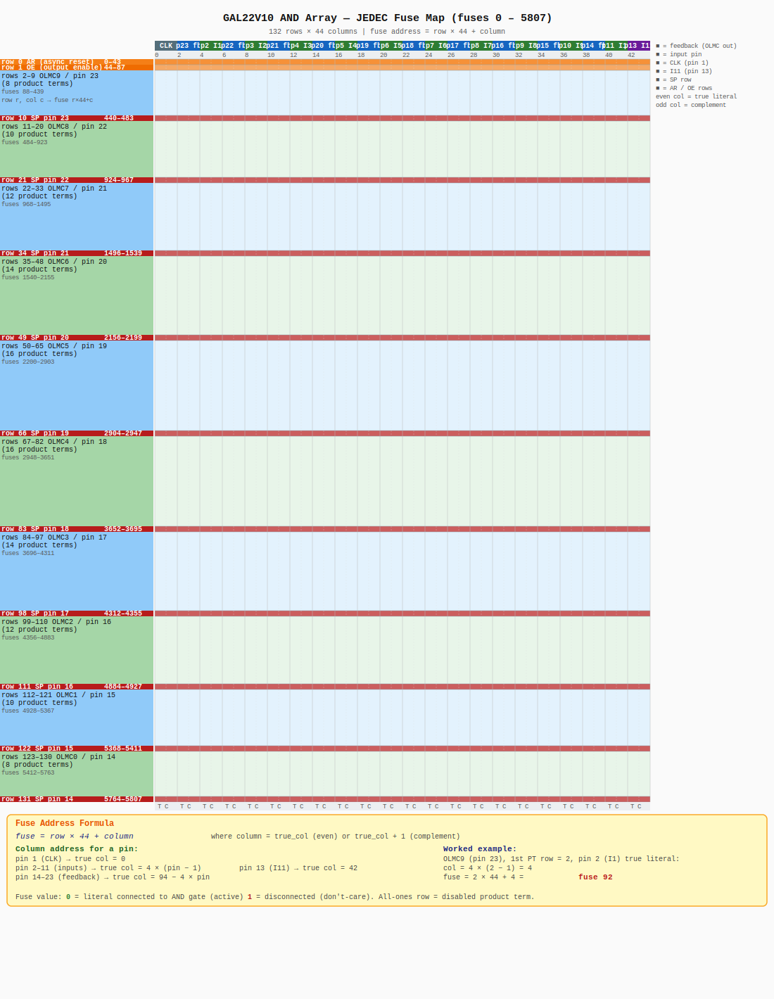

# GALLANG


> **Logic in design, Power in code.**  
> A domain-specific language for programming GAL22V10 / ATF22V10C programmable logic devices — created by the **Hong Kong Programming Society (HKPS)**.

GALLANG compiles `.gal` source files directly to JEDEC `.jed` files ready to burn with `minipro`. No intermediate tools (galasm, WinCUPL, etc.) are required.

---

## Table of Contents

- [GALLANG](#gallang)
  - [Table of Contents](#table-of-contents)
  - [Target Device](#target-device)
  - [Requirements](#requirements)
  - [Build](#build)
  - [Usage](#usage)
  - [Language Reference](#language-reference)
    - [File Structure](#file-structure)
    - [Pins Section](#pins-section)
    - [Logic Section](#logic-section)
    - [Operators](#operators)
    - [Intermediate Signals](#intermediate-signals)
    - [Registered Outputs](#registered-outputs)
  - [Examples](#examples)
    - [AND / OR Combinatorial Logic](#and--or-combinatorial-logic)
    - [D Flip-Flop (Registered Output)](#d-flip-flop-registered-output)
    - [Mixed: Intermediate + Combinatorial](#mixed-intermediate--combinatorial)
  - [Product Term Limits](#product-term-limits)
  - [GAL22V10 Pin Map](#gal22v10-pin-map)
  - [Programming the Device](#programming-the-device)
  - [Project Architecture](#project-architecture)
    - [Compilation Pipeline](#compilation-pipeline)
    - [JEDEC Fuse Map (GAL22V10)](#jedec-fuse-map-gal22v10)
      - [AND Array (fuses 0 – 5807)](#and-array-fuses-0--5807)
      - [Configuration Bits (fuses 5808 – 5827)](#configuration-bits-fuses-5808--5827)
      - [UES (fuses 5828 – 5891)](#ues-fuses-5828--5891)
      - [Worked Example — Simple AND Gate](#worked-example--simple-and-gate)

---

## Target Device

| Device | Package | I/O | Fuses | Notes |
|--------|---------|-----|-------|-------|
| GAL22V10 | DIP-24 | 10 configurable OLMCs | 5892 | Lattice original |
| ATF22V10C | DIP-24 | 10 configurable OLMCs | 5892 | Atmel/Microchip clone, 100% pin-compatible |

Both devices are 5 V EEPROM-based programmable logic, erased and reprogrammed in-circuit with a device programmer such as `minipro` + TL866.

---

## Requirements

| Tool | Version | Purpose |
|------|---------|---------|
| Java JDK | 11 or later | Compile & run gallang |
| Apache Maven | 3.6+ | Build the fat jar |
| minipro | any | Burn `.jed` to the device |

---

## Build

```bash
git clone <repo>
cd gallang
mvn package
```

This produces `target/gallang.jar` — a self-contained fat jar with all dependencies bundled.

---

## Usage

```bash
java -jar target/gallang.jar <input.gal> [output.jed]
```

| Argument | Description |
|----------|-------------|
| `input.gal` | Source file written in the gallang language |
| `output.jed` | Optional. Defaults to `<input>.jed` next to the source file |

**Example:**

```bash
java -jar target/gallang.jar example/example.gal
# → writes example/example.jed
```

**Burn to device:**

```bash
minipro -p ATF22V10C -w example/example.jed
```

---

## Language Reference

### File Structure

A `.gal` file has exactly two sections, in order:

```
pins
  <pin assignments>

logic
  <boolean equations>
```

Comments use `//` and run to end-of-line.

---

### Pins Section

Maps physical pin numbers to signal names.

```
pins
1=clk
2=A  3=B  4=C     // multiple assignments per line are fine
23=out  22=carry
```

**Fixed pins** (cannot be reassigned):

| Pin | Function |
|-----|----------|
| 1   | CLK — dedicated clock input for registered outputs |
| 12  | GND |
| 24  | VCC |

**Input-only pins:** 1, 2, 3, 4, 5, 6, 7, 8, 9, 10, 11, 13  
**Output (OLMC) pins:** 14, 15, 16, 17, 18, 19, 20, 21, 22, 23

---

### Logic Section

Defines the Boolean function for each output pin.

```
logic
out = A * B + C    // combinatorial: out = (A AND B) OR C
```

Each output signal must appear in the `pins` section and be mapped to an output pin (14–23). All other signals in equations are either inputs from the `pins` section, or **intermediate** signals that are automatically inlined.

---

### Operators

| Operator | Symbol | Precedence | Description |
|----------|--------|------------|-------------|
| OR | `+` | lowest | Logical OR |
| AND | `*` | middle | Logical AND |
| NOT | `/` | highest | Logical NOT (prefix) |
| Grouping | `( )` | — | Override precedence |

**Operator examples:**

```
// AND has higher precedence than OR:
out = A + B * C         // A OR (B AND C)

// Use parentheses to override:
out = (A + B) * C       // (A OR B) AND C

// NOT is prefix, applied to the next atom or group:
out = /A * B            // (NOT A) AND B
out = /(A + B)          // NOT (A OR B)  → De Morgan: /A * /B
```

---

### Intermediate Signals

Any signal used in an equation but **not** listed in the `pins` section is treated as an intermediate (local) signal and is **automatically inlined** into the equations that use it.

```
pins
2=A  3=B  4=C
23=out

logic
sum = A * /B + /A * B   // intermediate: XOR
out = sum * C           // inlined → (A*/B + /A*B) * C
```

Chains of intermediates are resolved iteratively. Circular definitions are not permitted.

---

### Registered Outputs

Add `.r` (or `.R`) to the left-hand side to make an output **registered** (clocked D flip-flop, triggered on the rising edge of CLK / pin 1).

```
logic
Q.r = D          // Q is the flip-flop output; D is its next-state input
```

The equation defines the **D input** of the flip-flop. The device's CLK pin (pin 1) must be connected to a clock signal.

Feedback: registered outputs can be read back in other equations (using the signal's name directly):

```
Q.r = /Q          // toggle flip-flop: Q inverts on every clock edge
```

---

## Examples

### AND / OR Combinatorial Logic

```gal
// example/andtest.gal
pins
2=A  3=B
23=Y  22=Z

logic
Y = A * B    // AND gate
Z = A + B    // OR gate
```

```bash
java -jar target/gallang.jar example/andtest.gal
```

---

### D Flip-Flop (Registered Output)

```gal
// example/dfftest.gal
pins
1=clock
2=D
23=Q

logic
Q.r = D      // rising-edge D flip-flop
```

```bash
java -jar target/gallang.jar example/dfftest.gal
```

---

### Mixed: Intermediate + Combinatorial

```gal
// example/example.gal
pins
1=clock
4=a  5=b  10=c
23=out

logic
z   = a + b*c    // intermediate: a OR (b AND c) — inlined automatically
out = z          // combinatorial output
```

---

## Product Term Limits

Each output OLMC has a fixed number of AND-plane rows (product terms). The total per-output limit is:

| Output Pin | Max Product Terms |
|------------|-------------------|
| 23         | 8                 |
| 22         | 10                |
| 21         | 12                |
| 20         | 14                |
| 19         | 16                |
| 18         | 16                |
| 17         | 14                |
| 16         | 12                |
| 15         | 10                |
| 14         | 8                 |

The compiler will report an error if a Boolean expression expands to more product terms than the OLMC supports. Place functions with many OR terms on pins 18 or 19.

---

## GAL22V10 Pin Map

```
        ┌────── DIP-24 ──────┐
  CLK   │  1              24 │  VCC
   I1   │  2              23 │  O1 / I11 (OLMC)
   I2   │  3              22 │  O2 / I10 (OLMC)
   I3   │  4              21 │  O3 / I9  (OLMC)
   I4   │  5              20 │  O4 / I8  (OLMC)
   I5   │  6              19 │  O5 / I7  (OLMC)
   I6   │  7              18 │  O6 / I6  (OLMC)
   I7   │  8              17 │  O7 / I5  (OLMC)
   I8   │  9              16 │  O8 / I4  (OLMC)
   I9   │ 10              15 │  O9 / I3  (OLMC)
  I10   │ 11              14 │  O10/ I2  (OLMC)
  GND   │ 12              13 │  I11
        └────────────────────┘
```

- **OLMC pins (14–23):** configurable as combinatorial output, registered output, or input (feedback)
- **CLK (pin 1):** used automatically when `.r` equations are present
- **Pin 13:** additional dedicated input

---

## Programming the Device

With a TL866II+ or compatible programmer and `minipro` installed:

```bash
# Erase (optional, EEPROM auto-erases on write)
minipro -p ATF22V10C -E

# Program
minipro -p ATF22V10C -w output.jed

# Verify
minipro -p ATF22V10C -m output.jed
```

---

## Project Architecture

```
gallang/
├── pom.xml                                  Maven build (Java 11, ANTLR 4.13.1)
├── example/                                 Sample .gal files and generated .jed
└── src/main/
    ├── antlr4/com/gallang/
    │   └── GalLang.g4                       ANTLR4 grammar
    └── java/com/gallang/
        ├── Main.java                        Entry point
        ├── ast/
        │   ├── Program.java                 Top-level AST node
        │   ├── Equation.java                Single Boolean equation
        │   └── expr/
        │       ├── Expr.java                Abstract expression
        │       ├── VarExpr.java             Signal reference
        │       ├── AndExpr.java             A * B
        │       ├── OrExpr.java              A + B
        │       └── NotExpr.java             /A
        └── compiler/
            ├── AstBuilder.java              ANTLR visitor → AST
            ├── LogicCompiler.java           Inline intermediates, validate pins
            ├── SopConverter.java            Expr tree → Sum-of-Products
            ├── Literal.java                 Single literal in a product term
            ├── JedecGenerator.java          SOP → JEDEC fuse map (direct, no galasm)
            └── PldEmitter.java              (legacy) GALasm .pld text emitter
```

### Compilation Pipeline

```
.gal source
    │
    ▼ ANTLR4 lexer + parser (GalLang.g4)
Parse Tree
    │
    ▼ AstBuilder (visitor)
AST  (Program → Equation → Expr tree)
    │
    ▼ LogicCompiler
      • Inline intermediate signals
      • Validate pin assignments
CompiledProgram  (pin → SOP-ready Expr)
    │
    ▼ SopConverter
      • De Morgan normalization
      • Expand to List<List<Literal>>
Sum-of-Products
    │
    ▼ JedecGenerator
      • AND-array row encoding (132 rows × 44 cols)
      • OLMC config bits (SYN, AC0, AC1, XOR)
      • JEDEC checksums (fuse + file)
.jed  ──► minipro ──► GAL22V10 / ATF22V10C
```

### JEDEC Fuse Map (GAL22V10)

The 5892-fuse array is structured as follows:

| Region | Fuses | Description |
|--------|-------|-------------|
| AND array | 0 – 5807 | 132 rows × 44 columns product terms |
| Config | 5808 – 5827 | SYN, AC0, AC1[9:0], XOR[8:1] |
| UES | 5828 – 5891 | User Electronic Signature (64-bit label) |

#### AND Array (fuses 0 – 5807)



The AND plane is a 132 × 44 matrix.  
**Fuse address formula:** `fuse = row × 44 + column`

**Row assignments:**

| Row(s) | Description | Pin |
|--------|-------------|-----|
| 0 | AR — global asynchronous-reset product term | — |
| 1 | OE — global output-enable (all-ones → always enabled) | — |
| 2 – 9 | OLMC9: 8 product terms | 23 |
| 10 | OLMC9: SP (synchronous preset) row | 23 |
| 11 – 20 | OLMC8: 10 product terms | 22 |
| 21 | OLMC8: SP row | 22 |
| 22 – 33 | OLMC7: 12 product terms | 21 |
| 34 | OLMC7: SP row | 21 |
| 35 – 48 | OLMC6: 14 product terms | 20 |
| 49 | OLMC6: SP row | 20 |
| 50 – 65 | OLMC5: 16 product terms | 19 |
| 66 | OLMC5: SP row | 19 |
| 67 – 82 | OLMC4: 16 product terms | 18 |
| 83 | OLMC4: SP row | 18 |
| 84 – 97 | OLMC3: 14 product terms | 17 |
| 98 | OLMC3: SP row | 17 |
| 99 – 110 | OLMC2: 12 product terms | 16 |
| 111 | OLMC2: SP row | 16 |
| 112 – 121 | OLMC1: 10 product terms | 15 |
| 122 | OLMC1: SP row | 15 |
| 123 – 130 | OLMC0: 8 product terms | 14 |
| 131 | OLMC0: SP row | 14 |

> **Product-term rows** hold AND conditions. A fuse value of **0** means the signal is _connected_ to the AND gate; **1** means _disconnected_. An all-ones row is a disabled (don't-care) term. The JEDEC `*F0` default sets every fuse to 0 (all connected → X·/X = 0 per row = logic 0), so the compiler only needs to write the active rows.
>
> **SP rows** (synchronous-preset) are normally all-ones for every active combinatorial OLMC except the one on the lowest pin number used, which stays all-zeros.

**Column assignments (44 columns per row):**

Each signal is represented by a _true_ column (even) immediately followed by its _complement_ column (odd). A fuse of **0** connects that literal to the AND gate.

| Columns | Signal | Physical pin |
|---------|--------|-------------|
| 0, 1 | CLK (true / complement) | 1 |
| 2, 3 | O1 feedback (true / complement) | 23 |
| 4, 5 | I1 (true / complement) | 2 |
| 6, 7 | O2 feedback (true / complement) | 22 |
| 8, 9 | I2 (true / complement) | 3 |
| 10, 11 | O3 feedback (true / complement) | 21 |
| 12, 13 | I3 (true / complement) | 4 |
| 14, 15 | O4 feedback (true / complement) | 20 |
| 16, 17 | I4 (true / complement) | 5 |
| 18, 19 | O5 feedback (true / complement) | 19 |
| 20, 21 | I5 (true / complement) | 6 |
| 22, 23 | O6 feedback (true / complement) | 18 |
| 24, 25 | I6 (true / complement) | 7 |
| 26, 27 | O7 feedback (true / complement) | 17 |
| 28, 29 | I7 (true / complement) | 8 |
| 30, 31 | O8 feedback (true / complement) | 16 |
| 32, 33 | I8 (true / complement) | 9 |
| 34, 35 | O9 feedback (true / complement) | 15 |
| 36, 37 | I9 (true / complement) | 10 |
| 38, 39 | O10 feedback (true / complement) | 14 |
| 40, 41 | I10 (true / complement) | 11 |
| 42, 43 | I11 (true / complement) | 13 |

> Output-feedback columns (2, 6, 10 …) carry the OLMC's registered or combinatorial output back into the AND plane, allowing the device to implement state machines or logic that depends on its own outputs.

**Column address formula for a given pin:**

```
pin  1  (CLK)           → true col = 0
pin  2–11  (inputs I1–I10) → true col = 4 × (pin − 1)
pin  13  (input I11)    → true col = 42
pin  14–23  (OLMC feedback) → true col = 94 − 4 × pin
complement col           = true col + 1
```

**Worked example** — fuse for the true literal of pin 2 (I1) in the first product-term row of OLMC9 (pin 23):
- Row = 2 (first PT row of OLMC9)
- Column = 4 × (2 − 1) = 4
- Fuse = 2 × 44 + 4 = **92**

#### Configuration Bits (fuses 5808 – 5827)

20 bits immediately after the AND array control the OLMC mode for each output:

| Fuse | Bit name | Value | Meaning |
|------|----------|-------|---------|
| 5808 | SYN | 1 (always) | Synchronous mode — must always be 1 for GAL22V10 |
| 5809 | AC0 | 1 if any combinatorial output, else 0 | Global combinatorial-enable flag |
| 5810 | AC1[9] | 1 = combinatorial, 0 = registered | OLMC9 — pin 23 |
| 5811 | AC1[8] | 1 = combinatorial, 0 = registered | OLMC8 — pin 22 |
| 5812 | AC1[7] | 1 = combinatorial, 0 = registered | OLMC7 — pin 21 |
| 5813 | AC1[6] | 1 = combinatorial, 0 = registered | OLMC6 — pin 20 |
| 5814 | AC1[5] | 1 = combinatorial, 0 = registered | OLMC5 — pin 19 |
| 5815 | AC1[4] | 1 = combinatorial, 0 = registered | OLMC4 — pin 18 |
| 5816 | AC1[3] | 1 = combinatorial, 0 = registered | OLMC3 — pin 17 |
| 5817 | AC1[2] | 1 = combinatorial, 0 = registered | OLMC2 — pin 16 |
| 5818 | AC1[1] | 1 = combinatorial, 0 = registered | OLMC1 — pin 15 |
| 5819 | AC1[0] | 1 = combinatorial, 0 = registered | OLMC0 — pin 14 |
| 5820 | XOR[8] | 0 = active-high (gallang always 0) | Output polarity — pin 23 |
| 5821 | XOR[7] | 0 = active-high | Output polarity — pin 22 |
| 5822 | XOR[6] | 0 = active-high | Output polarity — pin 21 |
| 5823 | XOR[5] | 0 = active-high | Output polarity — pin 20 |
| 5824 | XOR[4] | 0 = active-high | Output polarity — pin 19 |
| 5825 | XOR[3] | 0 = active-high | Output polarity — pin 18 |
| 5826 | XOR[2] | 0 = active-high | Output polarity — pin 17 |
| 5827 | XOR[1] | 0 = active-high | Output polarity — pin 16 |

> **AC1 contiguous-block extension rule:** When the used combinatorial outputs form a contiguous block starting at pin 23 (OLMC indices 0 … N), the assembler also sets AC1=1 for OLMC indices up to `2N−1`. For example, 4 outputs at pins 20–23 (indices 0–3, N=3) causes indices 4 and 5 (pins 19 and 18) to be set as well. gallang replicates this behaviour for bit-exact compatibility.

#### UES (fuses 5828 – 5891)

64-bit User Electronic Signature — a free-form label burned into the device. gallang leaves these fuses at 0 (not written to the JEDEC file).

Row 0 is the global async-reset PT; row 1 is the global output-enable PT. The 10 OLMCs (pins 23 down to 14) follow, each with their own product-term rows and a synchronous-preset row.

#### Worked Example — Simple AND Gate

Circuit: **Z = A & B** — output on pin 23 (OLMC9), input A on pin 2, input B on pin 3.

**Step 1 — find the column addresses**

The column formula for input pins 2–11 is `col = 4 × (pin − 1)` (true), `col + 1` (complement).

| Signal | Column | Fuse convention |
|--------|--------|-----------------|
| A — pin 2, true | 4 | 0 = connected |
| A — pin 2, complement | 5 | 1 = disconnected |
| B — pin 3, true | 8 | 0 = connected |
| B — pin 3, complement | 9 | 1 = disconnected |
| all other 40 columns | — | 1 = disconnected |

**Step 2 — find the row and fuse addresses**

OLMC9 (pin 23) owns rows 2–9 (8 product terms) and SP row 10.

| Row | Purpose | Fuse state |
|-----|---------|------------|
| 2 | **Z = A & B** | all 1s, **except fuse 92 (A true) = 0 and fuse 96 (B true) = 0** |
| 3 – 9 | unused PTs | all 44 fuses = 0 (A & /A & … → always 0; contributes nothing to OR) |
| 10 | SP (sync preset) | all 44 fuses = 0 (disabled) |

```
fuse = row × 44 + column
fuse 92 = 2 × 44 + 4    ← A (pin 2 true)
fuse 96 = 2 × 44 + 8    ← B (pin 3 true)
```

**Step 3 — configuration fuses**

| Fuse | Name | Value | Reason |
|------|------|-------|--------|
| 5808 | SYN | 1 | combinatorial mode |
| 5809 | AC0 | 1 | at least one combinatorial output |
| 5810 – 5818 | AC1[9..1] | 0 | OLMCs 1–8 unused |
| **5819** | **AC1[0]** | **1** | OLMC9 / pin 23 is combinatorial |
| 5820 – 5827 | XOR[8..1] | 0 | no polarity inversion |

**Complete set of 0-valued fuses for this circuit:** 92, 96, and 5819 — every other fuse in the 5828-fuse range is 1.
